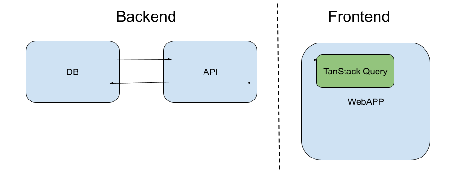
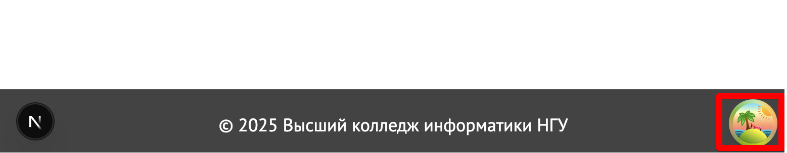
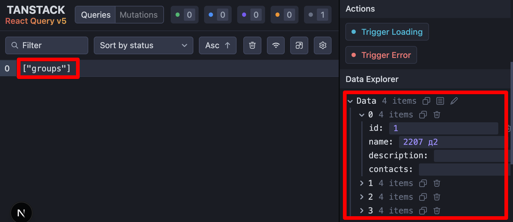
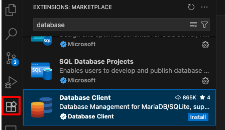
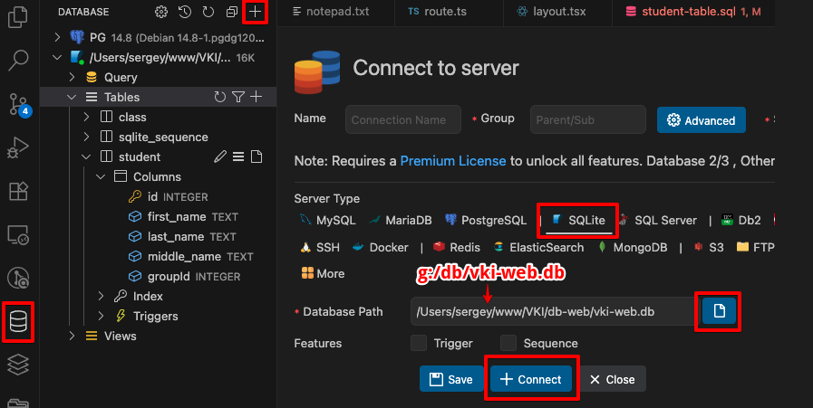
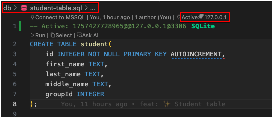
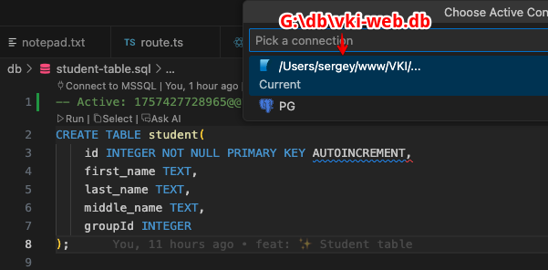
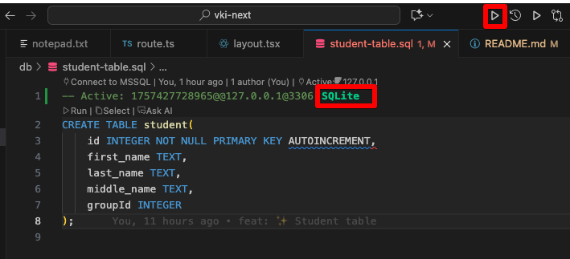

# Знакомство со стеком React, Next.js, TanStack Query, SQLite

## Установка 

1) Открыть cmd, выполнить (cклонировать проект на диск С: в личную папку (на диске G: проект не развернется):
    ```
    git clone https://github.com/sergeyvo80/vki-next
    ```

2) Открыть в VSCode, в терминале VSCode выполнить:
    ```
    Set-ExecutionPolicy -Scope CurrentUser RemoteSigned
    ```

3) Установить npm пакеты:
    ```
    npm i
    ```

4) Запустить проект:
    ```
    npm run dev
    ```

### Открыть в браузере две вкладки

http://localhost:3000/ - приложение

http://localhost:3000/api/groups - апи


## Конфигурация
1) Создать файл .env.local в корне проекта
    ```
    # .env.local
    DB="g:/db/vki-web.db"
    NEXT_PUBLIC_API="http://localhost:3000/api/"
    ```
2) Скопировать базу данных и ./db/vki-web.db в G:\db\vki-web.db

## Назначение файлов

### Приложение

- Главный шаблон (точка входа) - src/app/layout.tsx 
- Компоненты шаблона - src/app/components/layout
- Страница - src/app/groups/page.tsx
- Компонент - src/components/Groups/Groups.tsx
- Хук получения данных - src/hooks/useGroups.tsx
- Получение данных из API - src/api/groupsApi.ts

### API

- API возвращает список групп - src/app/groups/route.ts
- Запрос к БД - src/db/groupDb.ts
- Стартовая БД и запросы - папка db в корне проекта

## Работа с данными


## Работа с данными в приложении TanStack Query




## Работа с БД SQLite

### Установить плагин



### Подключение к БД



### Выполнение запроса





## Git
```
git config --global user.name "Your Name"
git config --global user.email "your.email@example.com"
```

## Ссылки

- [Next.js Documentation](https://nextjs.org/docs) - learn about Next.js features and API.
  
- [Learn Next.js](https://nextjs.org/learn) - an interactive Next.js tutorial.

- TanStackQuery - https://tanstack.com/query/latest

- https://nextjs.org/docs/app/api-reference/file-conventions/route

